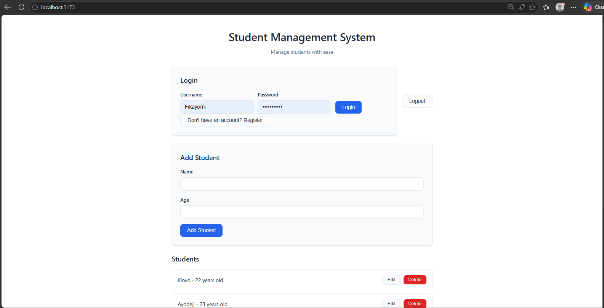

# Student Management System

A full-stack Student Management System built with *ASP.NET Core Web API* and *React*. The application provides authenticated users with the ability to manage student records, with role-based access control for administrative actions.

## Features

- User registration and login
- JWT-based authentication
- Role-based authorization
- User and Admin roles
- Create, read, update, and delete student records
- Admin-only student deletion
- SQL Server database integration
- Entity Framework Core
- BCrypt password hashing
- React frontend connected to ASP.NET Core Web API
- RESTful API
- Swagger/OpenAPI documentation

## Technologies Used

### Backend

- C#
- ASP.NET Core Web API
- Entity Framework Core
- SQL Server
- JWT Authentication
- BCrypt
- Swagger / OpenAPI

### Frontend

- React
- JavaScript
- HTML
- CSS
- Vite

## Screenshots

### Login / Registration

### Student Dashboard

### Admin Dashboard

### Swagger API

